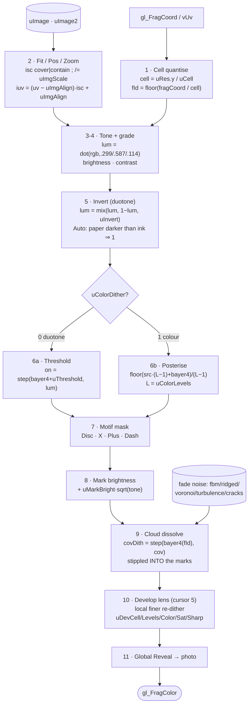

# Shading — canonical record (NAIL IT DOWN)

The dither shading is the heart of tomfolio. **This file is the source of truth for the
current shader state, and every shading change MUST be logged here in the same commit.**
Miss nothing: uniforms (name · units · default · range · meaning), palettes, cursor modes,
and the reveal / develop / crossfade / motion behaviours.

> Units rule: the **same unit for the same concept**, everywhere. Cell density is always a
> *cell count* (`uCell`, `uDevCell`); polarity is always `uInvert`; etc. No multipliers where
> a sibling control uses absolute counts.

## Files + lockstep

- **Shader:** `src/directions/press/art.ts` — the `pressFrag` template string. The only place
  the GLSL lives; reused by the rig, letterpress, the press direction, and the artefact.
- **Uniform defaults:** `src/gl/scene.ts` (the `uniforms` object) + `setImage` / `setImage2`.
- **Palettes — ONE source of truth:** `PALETTE_DATA` in `src/palettes.ts` (currently **54**).
  Derived from it: `PALETTES` (hex), `COLORS` (dev-bar labels), `COLORWAY_NAMES` (rig select),
  and the shader `uColorway` if-chain via `generatePaletteGLSL()` spliced into `pressFrag`. Edit a
  colorway there and nowhere else; `scripts/palettes-check.mjs` enforces it. (Was 4 hand-synced
  copies — shader if-chain, `PALETTES`, `COLORS`, rig options — collapsed in the Phase-1 health pass.)

## How the shader works

One fullscreen **fragment shader** (`pressFrag`) on a single three.js quad does everything —
no CPU image processing, no second pass. The one idea: **ink where dark, on an ordered grid.**
A 4×4 **Bayer** matrix gives every cell a fixed threshold; a cell becomes an ink mark when its
tone falls below that threshold. Ordered (not random) thresholds turn flat tones into clean
regular dots. `1.0 = paper (ground)`, `0.0 = ink (mark)`; the colorway's paper *is* the plate
ground, so a faded mark is just ground — no CSS mask, no seam.

1. **Cell quantise** — square grid; all fragments in a cell agree on the tone, so marks stay crisp.
2. **Fit/Pos/Zoom** — photo mapped into a fixed plate box; outside `[0,1]` → `inImg=0` → ground (letterbox / off-edge bleed).
3–4. **Tone + grade** — sample at the cell centre, luma, brightness/contrast.
5. **Invert** — duotone only; on dark stocks you ink the *highlights* so the photo reads naturally. Auto flips when `paperLum < inkLum` (why a mostly-dark photo reads sparse on a dark stock).
6. **Dither** — duotone thresholds, full-colour posterises per channel; both keyed by the *same* `bayer4(fId)`.
7. **Motif** — the mark *shape* is a per-cell distance field (Disc/X/Plus/Dash), rotated + stroke-thinned.
8. **Mark brightness** — root-proportional lift so bright marks glow without washing shadows.
9. **Cloud dissolve** — the fade is *stippled into the dither* (drops whole cells in Bayer order), driven by an animated, domain-warped noise field with its own width + scroll.
10. **Develop lens** — under the cursor, a finer sub-grid re-dithers the graded source in place (its own Colorize/Saturation/Pop/**Levels** + Stage→Resolve ramps).
11. **Global Reveal** — resolves the whole plate to the true natural-light photo.

## Uniform inventory

| Uniform | Units | Default | Range | Meaning |
|---|---|---|---|---|
| `uCell` | cell count | 150 | 16–600 | base screen frequency; on-screen mark size = `uRes.y / uCell` |
| `uMotif` | enum | 1 | 0–4 | 0 dots, 1 disc, 2 x, 3 plus, 4 dash |
| `uMotifWeight` | 0–1 | 0.62 | 0.05–1 | mark thickness / dot radius |
| `uMotifAngle` | turns | 0 | 0–1 | mark rotation in its cell |
| `uMotifTone` | 0–1 | 0.5 | 0–1 | stroke thickens with cell darkness |
| `uThreshold` | bias | 0.03 | −0.2–0.3 | Bayer threshold bias (`bayer4` mean = 0.5) |
| `uColorway` | index | 10 (Heather) | 0–53 | palette select |
| `uColorDither` | bool | 0 | 0/1 | 0 duotone (paper/ink), 1 full-colour ordered dither |
| `uColorLevels` | steps | 4 | 2–16 | posterise steps per channel in colour mode |
| `uMarkBright` | gain | 0 | −1–1 | brightness of the dither **mark** colour, applied AFTER quantise (never alters the dither pattern) and scaled by the mark's own **root** value `+ uMarkBright·sqrt(value)` per channel — lifts bright marks, leaves shadows; distinct from `uImageBrightness` (source) |
| `uToneBase` | 0–1 | 0.42/0.46 | — | procedural field base luminance |
| `uToneContrast` | 0–1 | 0.34/0.30 | — | field grain contrast |
| `uToneScale` | scale | 1.7/1.6 | — | field scale |
| `uDrift` | speed | 0.05/0.03 | — | field drift speed |
| `uImageOn` | 0–1 | 0 | 0–1 | field ↔ image crossfade amount |
| `uImage` / `uImageRes` | sampler | — | — | primary image slot + pixel size |
| `uImage2` / `uImage2Res` | sampler | placeholder | — | second image slot (image→image crossfade) |
| `uXfade` | 0–1 | 0 | 0–1 | 0 sample uImage, 1 sample uImage2 (no field flash) |
| `uImageBrightness` | added | 0 | −1–1 | image luminance offset (before invert + threshold) |
| `uImageContrast` | mult | 1 | 0.1–5 | image contrast around mid (before invert + threshold) |
| `uFit` | enum | 0 | 0/1 | image fit into the plate: 0 cover (fill, crop overflow), 1 contain (fit whole image, letterbox to ground via `inImg` mask) |
| `uImgAlign` | vec2 | (0.5,0.5) | −1–2 each | image anchor: slides the cover crop / contain letterbox. 0,0 = bottom-left, 1,1 = top-right; negative / >1 bleeds the photo off-edge (revealed area = ground via `inImg`). `iuv = (baseUv − uImgAlign)·isc + uImgAlign` |
| `uImgScale` | zoom | 1 | 0.2–5 | image zoom within the plate, on top of Fit: `isc /= uImgScale` (>1 samples a smaller region = zoom in, <1 larger = zoom out, surrounded by ground) |
| `uInvert` | bool | 0 | 0/1 | polarity flip, **duotone only** (full-colour never inverts — a colour negative reads as wrong colour). Resolved (in `artefact.ts`) from the Invert control: Off=0, On=1, **Auto** (default) = invert when `paperLum < inkLum` (dark-paper stock). The Invert + Auto rows hide while Full colour is on |
| `uFadeMode` | enum | 2 | 0–2 | edge dissolve: 0 off, 1 simple radial, 2 cloud. Applied **through the Bayer dither** (`step(bayer4(cellId), cov)`) — cells drop in dither order, stippling the fade into the marks rather than an alpha overlay |
| `uFadeScale` | freq | 1.2/3 | 0.5–20 | cloud-noise frequency **X** (mode 2; smaller = bigger billows) |
| `uFadeScaleY` | freq | 1.2/3 | 0.5–20 | cloud-noise frequency **Y** (independent vertical stretch of the cloud) |
| `uNoiseType` | enum | 0 | 0–4 | cloud mask noise: 0 fbm, 1 ridged (Musgrave creases), 2 voronoi (cellular), 3 turbulence (smoky), 4 cracks (Worley F2−F1 veins). Selected via `fadeNoise()` |
| `uFadeWarp` | amount | 0 | 0–3 | domain-warp applied to the cloud noise before evaluation (fbm-driven coord swirl) — reshapes ANY noise type into more organic/turbulent forms |
| `uCloudWidth` | scale | 1 | 0.2–5 | cloud horizontal extent, **independent of the image/plate**: scales `cuv.x` around centre before the dissolve + noise, so the cloud layer can be set wider/narrower than the photo box |
| `uCloudSpeed` | speed | 0.05 | 0–2 | cloud (mode 2) sideways scroll speed; 0 static. Continuous fbm offset = seamless, decoupled from `uDrift` |
| `uFadePos` | vec2 | (0,0) | −1–2 each | dissolve **anchor** in [0,1] plate space (x scaled by aspect); 0,0 = bottom-left (default). Moves where the gradient/cloud fade originates |
| `uMaskView` | bool | 0 | 0/1 | dev: output the raw fade coverage `cov` as grayscale (white = marks, black = ground), undithered — reveals the mask shape + moved anchor |
| `uReveal` | 0–1 | 0 | 0–1 | crossfade dither → true-colour photo (natural light); cell ramps up |
| `uImageState` | bool | 0 | 0/1 | dev: show the undithered adjusted source |
| `uCursorView` | bool | 0 | 0/1 | dev: show raw cursor influence `infl` as grayscale (white = peak, black = none) — reveals ellipse shape + orientation |
| `uCursorMode` | enum | 1 | 0–5 | 0 Off, 1 Clear, 2 Ink, 3 Bias, 4 Negative, 5 Develop |
| `uCursorAmp` | strength | 0.4 | 0–5 | cursor effect strength |
| `uCursorRadius` | falloff | 9.0 | 0.2–16 | cursor disc falloff rate (larger = tighter) |
| `uHold` | floor | 0 | 0–3 | static persistence floor under the movement-decayed strength |
| `uCursorEdge` | hardness | 0.25 | 0–2 | Negative-mode disc hardness |
| `uDevCell` | cell count | 450 | 40–3000 | Develop **Detail**: sub-grid cell count (same units as `uCell`) |
| `uDevColor` | 0–1 | 1 | 0–1 | Develop **Colorize** amount: 0 monochrome .. 1 full colour |
| `uDevStage` | 0–1 | 0.45 | 0–1 | Develop **Stage**: press point where the finer dither ramps in |
| `uDevResolve` | 0–1 | 1 | 0–1 | Develop **Resolve**: how fully a full press replaces the base marks with the fine dither (0 none, 1 full) |
| `uDevSat` | mult | 1 | 0–4 | Develop **Saturation** of the dithered colour (0 gray, >1 boost) |
| `uDevSharp` | 0–3 | 0 | 0–3 | Develop **Pop**: 4-tap unsharp / local-contrast boost in the develop region |
| `uDevLevels` | steps | 4 | 2–16 | Develop **Levels**: posterise steps per RGB channel for the develop colour — its own, decoupled from the full-colour `uColorLevels` |
| `uDevBright` | offset | 0 | −1–1 | Develop's own brightness, on top of the image grade, applied to the develop source before re-dithering |
| `uDevContrast` | mult | 1 | 0.1–5 | Develop's own contrast, on top of the image grade |
| `uCrossOn` / `uCrossSize` / `uCrossPos` | — | 1 / 0.075 / (0.62,0.58) | — | aviation-red registration cross |
| `uPress` / `uPressFalloff` | — | — | — | **REMOVED** (2026-06-30 cleanup; superseded by the cursor uniforms — see changelog) |
| `uMouse` / `uMouseStrength` | runtime | (0,0) / 0 | — | cursor position + movement-decayed strength (scene.ts) |
| `uMouseDir` | runtime | (0,1) | — | normalised pointer motion direction (unit vec2); lerped + renormalised each frame; stretch collapses to circle when `uMouseStrength = 0` |
| `uRes` / `uTime` / `uEnergy` / `uScrollVel` | runtime | — | — | system |

## Cursor modes (`uCursorMode`)

One shared per-cell influence scalar `infl = clamp(max(uMouseStrength, uHold), 0, 1) * exp(-md * uCursorRadius)`,
built only from `p` (one value per cell) — never varies `cell`/`cellId` spatially (that shatters the grid).
`md` is the **velocity ellipse** distance: `length(vec2(dAlong/stretch, dAcross/squash))` with
`stretch = 1 + 1.4·uMouseStrength` and **area-preserving** `squash = 1/stretch` — the disc stretches
along motion and tightens perpendicular by the same factor, so it stays a local comet (constant area)
rather than ballooning. Amplitude is clamped to [0,1] so the core never pegs to a flat blown-out slab.

- **0 Off** — no effect.
- **1 Clear** (default) — `lum += amp·infl`: lifts ink, opens paper under the cursor.
- **2 Ink** — `lum -= amp·infl` + thickens `wEff`: presses denser, swollen marks in.
- **3 Bias** — subtracts from the Bayer `threshold`: marks fill in the screen's own dot order.
- **4 Negative** — local polarity flip via a `smoothstep(uCursorEdge, …)` disc.
- **5 Develop** — local resolve that lives **inside the dither** (not a photo overlay): the source
  is graded — **Pop** (`uDevSharp`, 4-tap unsharp), **Saturation** (`uDevSat`), **Colorize**
  (`uDevColor` blends mono↔colour) — and then **re-dithered at `uDevCell`** detail (**Detail**).
  **Stage** (`uDevStage`) ramps the finer dither in, **Resolve** (`uDevResolve`) caps how fully it
  replaces the base marks. So a press develops into a finer, fuller **dither** of the photo —
  manipulating the source + marks directly. The only smooth-photo path is the global **Reveal**
  (applied as a separate `mix()`, last).

## Behaviours

- **Reveal** (`uReveal`, GSAP-tweened in `artefact.ts` `rev`): crossfades to the **true-colour
  photo in natural light** — no invert/brightness/contrast on the revealed source, so it never
  passes through a negative — while the cell count ramps geometrically (`REVEAL_CELL_MULT`).
- **Image → image** is a true crossfade through `uImage2`/`uXfade` (two slots, promote on complete);
  **field ↔ image** uses `uImageOn`. No procedural-field flash between photos.
- **Invert** is an Off / On / **Auto** control (`look.invertMode`), resolving to `uInvert`. Auto
  (default) is **palette-based**: invert when `paperLum < inkLum` (dark-paper stock), so a natural
  photo reads positive on any colorway with no manual toggling. Polarity is a *palette* property,
  not an image one — an image-histogram heuristic (designed via workflow) was rejected because it
  renders dark photos as negatives. A dev-bar status row shows the Auto decision + stock.
- **Motion** (DOM/GSAP, not a uniform): all dither/reveal tweens share one ease + duration via the
  artefact `EASES` list + `motion` (dev-bar Motion group). Default **quint ease-out, 0.6s**. The
  Motion group also carries **FPS** — Cine = `gsap.ticker.fps(24)`, **Commo** = 17 (deliberately
  choppy retro cadence), Fluid = uncapped (default Fluid; the ticker drives the whole render loop) —
  and a **live ease preview**: an inline SVG of
  `gsap.parseEase(selected)` with a playhead dot looping at the chosen duration.
- **Cloud scroll** (`uCloudSpeed`): cloud fade (mode 2) scrolls sideways via a continuous horizontal
  fbm offset (`+ vec2(uTime·uCloudSpeed, 0)`) — seamless / never-repeating, decoupled from `uDrift`.
  Dev-bar Screen group: **Cloud anim** toggle + **Cloud speed**; push `uCloudSpeed = anim ? speed : 0`.
- **Dev-bar layout**: a single floating **vertical panel** — collapsible (grip click / backtick) and
  **free-draggable** anywhere by its grip header (position persisted as `{x,y}`, re-clamped on
  restore). One scrolling column of all groups, so it never wraps. Settings export via Output >
  **Copy JSON** (full `{look, motion}` snapshot to clipboard, prompt() fallback).

## Palette families (54)

0–23 original print/letterpress set (Bone … Indigo Sun). 24–53 added 2026-06-29 in six
theme-dissenting families: **Jewel on jet** (24–29), **Candy/pastel** (30–35),
**Neon noir** (36–40), **Earth/botanical** (41–45), **Vapor/Y2K** (46–49), **Bold drench** (50–53).

## Changelog

Newest first. Log EVERY shading change here.

### 2026-06-30
- **Dev-bar consolidation + cloud-dissolve controls + image colorspace + boundary overlays.**
  - **Image colorspace fix:** image textures now upload as `NoColorSpace` (was `SRGBColorSpace`) —
    the GPU was auto-decoding sRGB→linear on sample while the shader outputs without re-encoding, so
    photos read ~gamma DARKER than source. Now true to source.
  - **Cloud-dissolve size/softness exposed:** new `uFadeReach` (default 1.45) + `uFadeSoft` (1.15)
    parameterise the previously-hardcoded `smoothstep(0.3, 1.45, fd)` → `smoothstep(reach-soft, reach)`.
  - **Fade group:** the whole edge dissolve now lives in one **Fade** group (renamed from Cloud):
    mode · Fade X/Y (position) · Reach (size) · Softness · Feather/Curve/Depth (right-edge) · cloud
    texture. The right-edge taper is back INSIDE the fade block (part of the mask — only with a fade on).
  - **Fluo boundary overlays (dev):** `uShowCanvas`/`uShowImage`/`uShowCloud` draw thin fluo borders —
    canvas/plate edge (green), fitted-image rect edge (magenta), mask contour cov~0.5 (yellow). Output
    group toggles. In `PARAM_SKIP` (not in JSON).
  - **Dev-bar UX:** inactive (`.is-na`) controls now **grey out instead of hiding**, so contextual
    controls never disappear; palette swatch readout (paper/ink/accent) above the Colour switcher.
  - **Nomenclature:** `Cell`+`Detail` → **`Cells`** (same unit); fade mode `Fade` → **`Type`**;
    cursor `Edge` → **`Hardness`**; `Show fade mask`/`Show cursor field` → **`Fade mask`**/**`Cursor field`**.
  - **JSON coverage confirmed complete:** 47 real settings round-trip; only 8 dev/transient flags excluded.
- **Right-edge falloff — reworked + shapeable.** The `uEdgeFade` / "Feather" taper now anchors to
  the **plate** (`baseUv.x`), **right edge only** — it was image-space (`iuv.x`, both edges), which
  is invisible whenever a wide image is cover-cropped (the photo's own right edge sits off-plate;
  e.g. the Cyber default with `collection-207`, aspect 1.49 vs plate ~1.14 → `isc0.x≈0.76` →
  `iuv.x` maxes ~0.76, so the taper never engaged on screen). Plate-anchored, it always tapers the
  visible right edge regardless of crop. Two new shaping uniforms (both default to the prior look):
  `uEdgeCurve` (ramp `pow(t, curve)`, default 1 — lower = harder shoulder) and `uEdgeDepth`
  (`mix(1-depth, 1, t)`, default 1 = to ground, <1 = a partial dot veil). Net:
  `et = pow(smoothstep(0, uEdgeFade, 1-baseUv.x), uEdgeCurve); cov = min(cov, mix(1-uEdgeDepth, 1, et))`.
  Dev-bar Feather / Curve / Depth under Image; wired via `PARAM_UNIFORMS` + `scene.ts`; auto in Copy JSON.
- **Sizing model recorded — canvas precedence.** The plate is a FIXED stage (full height ×
  `plateWidth` × viewport width); each photo cover-fits INTO it, so an image's source size/aspect
  never moves the layout (images pre-edited to suit). Fixed the stale "native aspect" docs
  (`applyCanvasWidth` leading comment + AGENTS.md) that described the old image-precedence behavior.
- **Dev-bar naming/help cleanup.** Fixed stale `Margin` help (colorway accent, not brand red); added
  the missing `Show cursor field` help; renamed `Radius`→`Falloff`, `Cloud X/Y`→`Billow X/Y`,
  `Cloud W`→`Cloud width`; `Cell`/`Detail` help note shared cell-count units. Static help-audit:
  0 orphan labels, 0 unused keys.
- **Health pass Phase 4 (partial) — data-driven `pushTreatment`.** The 35-line block of 1:1
  `setParam(uniform, look.field)` calls is now a `PARAM_UNIFORMS` map looped in `pushTreatment`
  (the single place to wire a numeric param's uniform); the derived / vec2 / conditional pushes
  (`uCell`=effectiveCell, `uInvert`=resolveAuto, `uImgAlign`/`uFadePos`, conditional `uCloudSpeed`)
  and the chrome/persist side effects stay explicit. Behaviour-identical — static parity check vs
  HEAD: 40 uniforms, 0 missing/extra/changed. (The dev-bar UI-generation registry is the remaining,
  riskier half — deferred pending a test harness, since the artefact exposes no state to assert
  control→uniform bindings.)
- **Starter-state update (Cyber).** Default colorway → **Cyber (37)**; image → `collection-207`;
  `brightness` 0.2→0.15; `posX` -0.2→0; `cloudSpeed` 0.05→0.01; `cursorMode` → 2 (Ink);
  `cursorRadius` 9→1.4 (bigger disc); `cursorDetail` 450→306. Colorway-paper lockstep updated to
  Cyber: CSS `--ground` `#04090c` / `--ink` `#19f7f7` / `--art-cursor` `#19f7f7`, HTML `theme-color`
  `#04090c`, `artefact-check.mjs` ground `rgb(4, 9, 12)`. (`edgeFade` left at 0.12 — absent from the
  snapshot.)
- **Health pass Phase 3 — fade-mask correctness.** Two shader fixes so the cloud/gradient mask
  fully governs visibility. **(a) Edge taper** — new `uEdgeFade` uniform (default 0.12; dev-bar
  Image > **Feather**, 0–0.5): inside the fade block, `cov = min(cov, smoothstep(0, uEdgeFade, ex))`
  where `ex = min(iuv.x, 1−iuv.x)`, so the photo's own L/R edge always dissolves into the ground over
  the last `uEdgeFade` of its width — kills the aspect-dependent hard right-edge leak independent of
  the cloud anchor; `fadePosX` is now a creative bias, not a per-image chore. Only when `uImageOn` and
  `uFadeMode > 0` (mode 0 stays full-bleed). **(b) Develop gate** — `localRev` is now multiplied by
  `cov` (post-taper) and `inImg`, so the Develop cursor can no longer re-reveal the photo through a
  dissolved or off-image region (Clear/Ink/Negative/Bias already self-limited; global Reveal unchanged).
  Verified: shader compiles (0 console errors), tsc + all checks clean. Visual confirmation (wide vs
  tall photo edge; Develop at the mask boundary) is interactive.
- **Health pass Phase 2 — quick wins.** Removed 3 legacy declared-but-unread uniforms
  (`uMouseDir`, `uPress`, `uPressFalloff`) from the shader + `scene.ts` (and the now-dead
  `dirTarget`/`kDir` plumbing in scene.ts's frame loop). `TRAIL_N` is now a single shared constant
  in new `src/gl/constants.ts`, imported by both `scene.ts` (ring buffer) and `art.ts` (interpolated
  into the GLSL `const int TRAIL_N = ${TRAIL_N}`) so they can't drift. Documented why the artefact
  entry needs no manual listener/interval teardown (Vite full-reloads it). No visual change.
- **Health pass Phase 1 — palette single source of truth.** New `src/palettes.ts` holds
  `PALETTE_DATA` (54); `PALETTES`/`COLORS`/`COLORWAY_NAMES` are derived and the shader `uColorway`
  if-chain is now generated by `generatePaletteGLSL()` spliced into `pressFrag` (the hardcoded
  if-chain + the `PALETTES` array were removed from `art.ts`). `artefact.ts` and `rig.ts` import the
  derived exports (local `COLORS`/inline rig options removed). New `scripts/palettes-check.mjs`
  guard. Verified zero color drift (hex↔old vec3 identical pre-migration; Noir renders
  `rgb(8,8,10)` through the generated chain). No visual/behaviour change — pure de-duplication.
- **Starter-state defaults update** (`look`/`motion`, `artefact.ts`): `plateWidth` 0.66→**0.71**,
  `posX` 0.5→**−0.2** (photo bleeds off the left edge), `fadePosX` 0→**0.4** (dissolve anchor X);
  ease → **Quint inout** (`power4.inOut`, easeIdx 5), fps → **Commo** (17fps). Also fixed a boot
  gap: `applyFps()` is now called at init (after `pushTreatment`), so the default frame cadence
  applies on load — previously it was only set on dev-bar change, which was invisible while the
  default was the uncapped Fluid but would otherwise leave Commo un-applied until first toggled.
- **Triple-click cursor burst (easter egg)**: a triple-click over the plate/menu (not the dev
  bar) makes the cursor effect **balloon across the plate** for a brief moment, then settle. New
  `GlScene.cursorBurst(peak=1, holdMs=300, radius=0.8)` (`scene.ts`) holds two uniforms flat for
  `holdMs`: it drops **`uCursorRadius` to `radius`** (the bloom — lower radius = bigger disc, per
  the shader `exp(-dseg * uCursorRadius)`) and pegs **`uMouseStrength` to `peak`** (so it stays
  visible instead of fading via the usual decay `strengthTarget *= exp(-dt*0.0022)`). On the last
  burst frame `uCursorRadius` is restored to its pre-burst value (captured at burst start; re-arm
  via rapid clicks keeps the original base) and the pegged strength is released to decay from the
  peak. Triggered in `artefact.ts` via `click` with `e.detail >= 3`; fine-pointer + `!reduced`
  only (no-op under reduced motion, where the frame loop is off). No shader change.
- **New load-in defaults** (`look` literal, `artefact.ts`): default image → `collection-236`,
  colorway → **11 Noir** (was 10 Heather), `cell` → **306** (was 150), `brightness` → **0.2**
  (was 0). All other `look`/`motion` fields already matched the requested snapshot. Because the
  default colorway changed, the colorway-paper lockstep was updated too: CSS fallback
  `--ground` `#08080a` / `--ink` `#e8e8ea` / `--art-cursor` `#e8e8ea` (`artefact.css`), HTML
  `theme-color` `#08080a` (`artefact.html`), and the `artefact-check.mjs` ground assertion
  `rgb(8, 8, 10)`. (`general` is snapshotted from the `look` literal at boot; nothing persists
  it to localStorage, so the literal is the true default.)
- **Frame-margin accent fix**: the "Margin → Accent" option was hardwired to the system brand
  red (`var(--accent)` = `#e61919`), ignoring each colorway's own accent. `applyColorwayChrome`
  now sets a dedicated `--art-accent` = `pal.accent` and the margin reads that, so Accent follows
  the palette (Heather → mauve `#c68d9a`). Also fixed the stale `artefact-check.mjs` frame-inset
  assertion (was 15px / label 25px) to the shipped **10px**.
- **Develop Levels** (`uDevLevels`, Cursor > Develop > **Levels**, 2–16, def 4): the develop
  colour now posterises with its OWN steps instead of reusing the full-colour `uColorLevels`
  (art.ts `fL = max(uDevLevels, 2.0)`), matching the full-image colourisation control.
- **Image placement**: `uImgAlign` (Pos X/Y) now goes **−1–2** (bleed the photo off-edge → ground via
  the `inImg` mask); new `uImgScale` (Image > **Zoom**, 0.2–5) scales the photo in/out within the plate
  on top of Fit (`isc /= uImgScale`). Applied to main + develop sampling.

- **Cloud width decoupled from the image** (`uCloudWidth`): scales the cloud's horizontal coord
  (around centre) before the dissolve + noise, so the cloud layer's width is independent of the photo
  box (`Width`). Cloud-group **Cloud W** stepper (mirrored in the noise thumbnail).

- **Image fit + position**: `uFit` (cover/contain) and `uImgAlign` (anchor vec2) — cover crops, contain
  fits the whole image and letterboxes to ground (`inImg` mask on the main composite + Reveal); the
  anchor slides the crop/letterbox (`(baseUv − uImgAlign)·isc + uImgAlign`), applied to main + develop.
  Image-group **Fit / Pos X / Pos Y** controls.
- **More cloud noise + Warp**: added `turbulence()` (smoky abs-fbm) and `worleyEdge()` (Worley F2−F1
  cracks/veins) → `uNoiseType` now 0–4 (fbm/ridged/voronoi/turbulence/cracks). New `uFadeWarp`
  domain-warps the sample coords through fbm before any noise type, so the mask reads organic.
  Cloud-group **Noise** (5 options) + **Warp** stepper.
- **Motif distinctness fix**: X / Plus / Dash were drawn with the same `wEff` half-width as the disc
  radius, but their distance fields (`min(dia,dib)` ~0.35 max) saturate well below `wEff`'s 0.5 cap —
  so at the default weight the strokes filled the whole cell and read identically to solid Dots. Gave
  the strokes a thinner `strokeW = clamp(wEff*0.4, 0.05, 0.18)` (base + develop fine block) so they
  render as crisp lines. (Motifs still need a low-ish Cell to resolve; tiny cells blur any shape.)
- **Plate box + Width** (`look.plateWidth`, not a uniform): the `#gl` canvas is now a FIXED box —
  full height × (Width × viewport width), default 66% — **decoupled from the photo aspect** (it used
  to auto-fit the image, which left no room for Fit/Pos to act). The photo fits into the box via the
  shader `uFit` / `uImgAlign`. Screen-group Width stepper (%).
- **Ellipse fix (scale + saturation)**: the velocity ellipse read as a plate-spanning blown-out beam
  at speed (captured via `uCursorView`; corroborated by a gemineye review). Three causes, all fixed:
  (1) **area was growing** — `squash = max(0.45, 1/√stretch)` scaled footprint by `√stretch`; now
  `squash = 1/stretch` (exact area preservation, redistributes into a needle). (2) **base disc too
  loose** — `uCursorRadius` default `2.2 → 9.0` (still tunable 0.2–16; the disc was plate-scale before
  any stretch). (3) **core clamped flat** — amplitude `max(uMouseStrength,uHold)` reaches 1.4 and pegged
  the centre to white; now `clamp(..., 0, 1)`. Stretch multiplier eased `2.5 → 1.4` (≈2.96× at full
  speed). Y-direction sign in `dirTarget` (scene.ts) negated to map screen-down → shader-up.
- **Cloud noise types + X/Y size**: `uNoiseType` (FBM / Ridged-Musgrave / Voronoi via `fadeNoise()`)
  and `uFadeScaleY` (independent vertical cloud frequency) — new **Cloud** dev-bar group (split from
  Screen) carrying Cloud X/Y, Noise, anim, speed, Fade X/Y; hidden when Fade = Off.
- **Develop group + own B/C**: develop controls moved to a dedicated **Develop** group (split from
  Cursor), hidden unless Mode = Develop; added `uDevBright`/`uDevContrast` (develop-region brightness
  + contrast, on top of the image grade).
- **Hover-to-change** toggle (DOM, beside Reveal): when on, hovering a menu item swaps the image.
- **Plate border** now uses the colorway **ink** colour (was white) at **15px** (was 25px).
- **Cursor field view** (`uCursorView`, Output > **Show cursor field**): renders raw `infl` as
  grayscale (white = peak influence, black = none), bypassing dither and colour — shows the
  ellipse shape, orientation, and falloff directly. Same pattern as `uMaskView` / `uImageState`.
- **Velocity-aware cursor ellipse**: the isotropic influence disc
  `infl = max(uMouseStrength,uHold)·exp(-md·uCursorRadius)` is now an ellipse oriented along the
  pointer's motion vector. New uniform `uMouseDir` (unit vec2, runtime, scene.ts) carries the
  normalised direction. Stretch = `1.0 + 1.5·uMouseStrength` (1.0 still → ~3.1 at full speed);
  decays to a circle automatically when `uMouseStrength → 0` (Hold mode stays circular). Applies
  to all cursor modes (Clear / Ink / Bias / Negative / Develop) via the shared `md` computation.
  No new dev-bar control — stretch is content-derived from existing speed tracking.
- **Fade mask viewer + movable anchor**: `uMaskView` (Output > **Show fade mask**) renders the raw
  `cov` as grayscale so the gradient/cloud shape is directly visible; `uFadePos` (Screen > **Fade X /
  Fade Y**) moves where the dissolve originates (default 0,0 = bottom-left).
- **Dev-bar info-circles**: every control label carries a hover ⓘ with concise helper text (fixed
  tooltip, `HELP` map in `artefact.ts`); action buttons get the same on hover.
- **Develop is now integrated, not an overlay**: removed the smooth photo `devTarget` cross-fade.
  Develop grades the source (Pop/Saturation/Colorize) then **re-dithers it** at `uDevCell`; Stage
  ramps it in, Resolve caps how fully the fine dither replaces the base marks. The only smooth-photo
  path is global Reveal. (Was: finer grain → faded a graded photo on top.)
- **Full-colour never inverts**: dropped `uInvert` from the colour dither paths (main + fine + image
  state); the **Invert + Auto rows hide while Full colour is on**. `uInvert` is now duotone-only.
- **Image canvas fits the source's native aspect**: `#gl` width is set in JS to `plateHeight ×
  imgAspect` (capped to 90% frame width), so photos show at original proportions / fill further
  right instead of being cover-cropped into the fixed CSS box. Reverts to CSS default for the field.
- **Dev bar → floating vertical panel**: replaced the bar↔rail dock toggle with one collapsible,
  **free-draggable** vertical panel (grip header drags it anywhere; position persisted + clamped).
  Output **Copy values → Copy JSON** now exports a full `{look, motion}` snapshot (clipboard +
  prompt fallback).
- **Cloud dissolve now stippled through the dither** (`step(bayer4(cellId), cov)`) — the cloud fade
  drops cells in Bayer order, affecting the dither pixels instead of overlaying a smooth alpha.
- **Mark brightness** `uMarkBright` (−1–1, def 0): brightens/darkens the dither mark colour itself
  (palette ink / colour dot), separate from `uImageBrightness` (source). Base + develop, duotone + colour.
- **Commo FPS 50 → 17** (deliberately choppy retro cadence).
- **Pixel-cross custom cursor** + click "detonation" (DOM/GSAP) — a box-shadow crosshair tracks the
  pointer (native hidden); clicking the plate bursts a ring of dither pixels + an elastic crosshair punch.
- **Stepper values are drag-to-scrub** (drag the number ≈6px/step), reusing the clamped dec/inc.
- **Wider ranges** across the artefact dev bar: Cell 16–600, Cloud 0.5–20, Cloud speed 0–2, Levels
  2–16, Brightness ±1, Contrast 0.1–5, cursor Strength 0–5 / Radius 0.2–16 / Hold 0–3 / Edge 0–2,
  Detail 40–3000, Stage 0–1, Saturation 0–4, Pop 0–3, Duration 0.05–5s. (Rig sliders keep their own.)
- **FPS preset "Commo"** (50fps — the PAL Commodore-64 vertical refresh; NTSC C64 was ~59.8) added
  alongside Fluid / Cine.
- **Motif surfaced contextually** in the Colour group (full-colour) and Cursor group (Develop),
  synced with the Screen Motif — the shader already applied `uMotif` in both paths.
- **Develop fine-tuning** — new uniforms `uDevStage` (grain→photo handoff, def 0.45, 0.1–0.9),
  `uDevResolve` (develop depth, def 1), `uDevSat` (saturation, def 1, 0–2), `uDevSharp` (4-tap
  unsharp Pop, def 0). `uDevColor` is now a **0–1 Colorize amount** (was 0/1 toggle). `uDevCell`
  range 120→**1200** (step 24). The two hardcoded develop smoothsteps are now driven by `uDevStage`;
  Develop resolves to its OWN colour-graded target (colorize/sat/pop), separated from the global
  Reveal (true source). Dev-bar Cursor group gains Stage/Resolve/Saturation/Pop + Colorize stepper.
- **Animated cloud** — `uCloudSpeed` (def 0.05, 0–0.5): cloud fade (mode 2) scrolls sideways via a
  continuous fbm horizontal offset (seamless, never-repeating), decoupled from `uDrift`. Screen
  group: Cloud anim toggle + Cloud speed.
- **FPS cadence** — Motion group Cine (24fps) / Fluid (uncapped) toggle via `gsap.ticker.fps()`.
- **Ease preview** — live inline-SVG graph of the selected GSAP ease with a real-time playhead dot.
- **Dev-bar layout toggle** — horizontal bar ↔ vertical side rail (full-height single-column scroll,
  grip-drag to dock left/right, persisted) — fixes horizontal wrap/resize at high control counts.

### 2026-06-29
- **Auto invert reintroduced** as Off/On/**Auto** (`look.invertMode`, default Auto). Auto is
  palette-based (`paperLum < inkLum` → invert) — correct natural polarity on every colorway; a
  dev-bar status row reports it. NOTE: a workflow-designed image-histogram ("mass-to-ground")
  heuristic was built and then REJECTED — it inverts dark photos (renders them as negatives);
  natural polarity is a palette property, not an image one.
- **Detail by cell count.** `uDevFine` (multiplier) → `uDevCell` (absolute cell count, same units
  as `uCell`); Develop fine cell = `uRes.y / uDevCell`. Default 450, range 120–960 step 12.
- **Dev bar:** clipping-proof layout — divisor-of-6 column counts (6/3/2/1 by breakpoint), viewport
  height cap + internal scroll. Develop **Colorize** toggle (`uDevColor`). Contextual controls hide
  (not dim). Merged Marks+Edge → "Screen".
- **Motion controls** — live Ease (cubic/quart/quint/expo/circ out, quint in-out, back out) +
  Duration; default quint ease-out 0.6s (was symmetric quad).
- **+30 colorways → 54** (six new families); fixed Bone (index 0) shader fall-through to Sepia.
- **Cursor effect modes** (Off/Clear/Ink/Bias/Negative/Develop) + Develop local cell-count increase.
- **Reveal → natural-light** (removed the `effInvert` reveal ramp that passed through a negative).
- **Image→image crossfade** via a second texture slot (`uImage2`/`uXfade`) — no field flash.
- **Auto image polarity** (`imgInv` by palette paper luminance) added, then **reverted** ("no auto").
- **Reveal/depixel sync** — geometric cell ramp so the marks resolve in step with the crossfade.
- **Inverted-image white-out @ reveal** fix.
